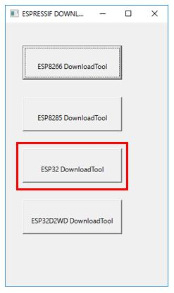
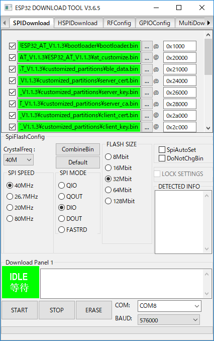
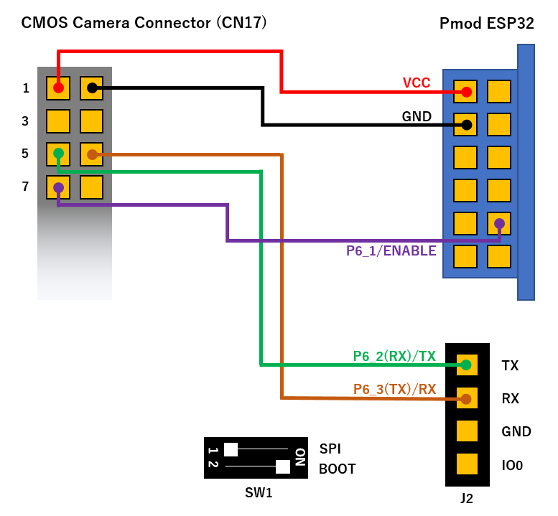

# esp32-at-ble-stack
This is a library for using Mbed OS BLE stack with ESP32. Please update the ESP32 firmware to ``AT version: 1.1.3.0 or later`` to use the BLE function.  
Please see the [Mbed OS Example BLE GitHub Repo](https://github.com/ARMmbed/mbed-os-example-ble) for all code examples, and the [Mbed OS BLE API page](https://os.mbed.com/docs/latest/apis/bluetooth.html) for all code documentation and general help.

It works properly only in the peripheral role. The center role does not work properly with the ESP32 firmware problem.  
The following samples have been verified to work.  
- [BLE_LED](https://github.com/ARMmbed/mbed-os-example-ble/blob/master/BLE_LED)
- [BLE_Button](https://github.com/ARMmbed/mbed-os-example-ble/blob/master/BLE_Button)  
- [BLE_BatteryLevel](https://github.com/ARMmbed/mbed-os-example-ble/blob/master/BLE_BatteryLevel)  
- [BLE_HeartRate](https://github.com/ARMmbed/mbed-os-example-ble/blob/master/BLE_HeartRate)  
- [BLE_Thermometer](https://github.com/ARMmbed/mbed-os-example-ble/blob/master/BLE_Thermometer)  


This library is used by combining [mbed-os](https://github.com/ARMmbed/mbed-os) and [esp32-driver](https://github.com/d-kato/esp32-driver). You need to add the following to ``mbed_app.json``:  
```
    "target.features_add"    : ["BLE"],
    "target.extra_labels_add": ["ESP32AT_BLE"]
```
Please refer to [RZ_A2M_BLE_sample](https://github.com/d-kato/RZ_A2M_BLE_sample) for details.  

## Getting Started
* [Mbed OS examples](https://os.mbed.com/teams/mbed-os-examples/) for all Mbed OS and BLE examples.
* [Mbed OS example BLE GitHub repo](https://github.com/ARMmbed/mbed-os-example-ble) for all Mbed OS BLE examples.
* [Mbed OS BLE introduction](https://os.mbed.com/docs/latest/apis/ble.html) for an introduction to Mbed BLE.
* [Mbed OS BLE API page](https://os.mbed.com/docs/latest/apis/bluetooth.html) for the Mbed BLE API documentation.


## How to update ESP32 firmware
### In the case of GR-LYCHEE or GR-PEACH
Please refer to the following.  
https://github.com/d-kato/GR-Boards_ESP32_Serial_Bridge

### In the case of RZ/A2M Evaluation Board Kit
Download the ESP32 firmware:  
https://www.espressif.com/en/support/download/at

Espressif’s official Flash Download Tools:  
http://espressif.com/en/support/download/other-tools?keys=&field_type_tid%5B%5D=13

  

  

Connection:  
  
Turn on SW1-2 of Pmod ESP32.  

Write the following firmware in the ``docs/serial_bridge`` to your board using custom boot loader:  
- ``RZ_A2M_EVB_EPS32_Serial_Bridge_application.bin``  

The firmware settings are described in ``ESP32_AT_Vxxx/download.config``.  
In the case of ESP32_AT_V1.2, the settings are as follows.  
* SPI SPEED : ``40MHz``
* SPI MODE : ``DIO``
* FLASH SIZE : ``32Mbit``
* COM : Set your board COM.
* BAUD : ``576000`` (If a write error occurs, try again with the smaller value.)  

|Path                                   |offset  |
|:--------------------------------------|:-------|
|ota_data_initial.bin                   |0x10000 |
|bootloader/bootloader.bin              |0x1000  |
|at_customize.bin                       |0x20000 |
|customized_partitions/ble_data.bin     |0x21000 |
|customized_partitions/server_cert.bin  |0x24000 |
|customized_partitions/server_key.bin   |0x26000 |
|customized_partitions/server_ca.bin    |0x28000 |
|customized_partitions/client_cert.bin  |0x2a000 |
|customized_partitions/client_key.bin   |0x2c000 |
|customized_partitions/client_ca.bin    |0x2e000 |
|customized_partitions/factory_param.bin|0x30000 |
|phy_init_data.bin                      |0xf000  |
|esp-at.bin                             |0x100000|
|partitions_at.bin                      |0x8000  |

Procedure:  
1. Connect the ``USB-F`` connector to your PC using a USB cable.  
   **Attention!** It is not a ``UART`` connector used for printf output. It is a connector used by custom boot loader.  
2. Press ``BTN1`` on Pmod ESP32.  
3. Press the ``Erase`` button on the tool to erase the unwanted data on the flash. The green area labeled ``IDLE`` in the tool changes to ``FINISH`` when finished.  
4. Press ``BTN1`` on Pmod ESP32.  
5. Press the ``START`` button on the tool to start writing. The green area labeled ``IDLE`` in the tool changes to ``FINISH`` when finished.  
